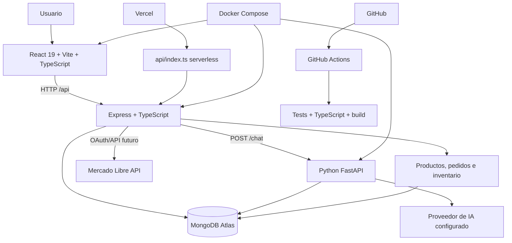

# Arquitectura de DYC Innovación

## Diagrama real

## Arquitectura utilizada

DYC separa la interfaz, la API, la persistencia y el servicio de IA. En desarrollo, Docker Compose coordina frontend, backend y Python. En Vercel existe un handler serverless en `api/index.ts`, pero el backend persistente y Python requieren una plataforma compatible con procesos o servicios separados.

## Justificación tecnológica

- **React:** permite construir la interfaz con componentes reutilizables para sitio público, login y dashboard.
- **Vite:** ofrece desarrollo rápido y un build optimizado para el frontend.
- **TypeScript:** detecta errores de tipos antes de ejecutar y documenta contratos de datos.
- **Express:** concentra la API REST, autenticación, autorización, uploads y reglas de negocio.
- **MongoDB Atlas:** almacena usuarios, productos, pedidos, inventario, contenido y actividad con un modelo flexible.
- **API REST:** separa cliente y servidor mediante endpoints claros y reutilizables.
- **JWT:** representa sesiones firmadas con expiración; el backend sigue validando usuario y rol.
- **bcryptjs:** protege contraseñas mediante hash, nunca almacenándolas en texto plano.
- **Docker:** reproduce el entorno de ejecución.
- **Docker Compose:** conecta frontend, backend y FastAPI en una red común con healthchecks.
- **Python/FastAPI:** encapsula el chatbot y su integración con contexto de MongoDB y el proveedor de IA.
- **Mercado Libre:** queda preparado como integración externa backend-only para sincronizar posteriormente productos y pedidos.
- **Separación frontend/backend:** evita exponer secretos y permite evolucionar UI, API e integraciones de manera independiente.

## Patrones comprobados

### Component-based architecture

Aparece en `src/components` y las páginas React. Resuelve reutilización y consistencia visual.

### Middleware

Aparece en `server/middleware/authMiddleware.ts`, CORS, manejo de errores y uploads. Resuelve preocupaciones transversales antes de llegar al controlador.

### Controller pattern

Aparece en `server/controllers`. Separa recepción de requests, reglas de negocio y respuestas HTTP.

### Service layer

Aparece en `server/services`, incluyendo email y estado de Mercado Libre. Aísla integraciones externas de las rutas.

### Data/model layer

Aparece en `server/models.ts` con Mongoose. Centraliza esquemas y relaciones de MongoDB.

### REST

Aparece en `server/routes/api.ts` y `server/routes/products.ts`, con métodos GET, POST, PUT, PATCH y DELETE.

### Separation of concerns

Frontend, backend, modelos, middleware y Python tienen responsabilidades separadas y se comunican mediante contratos HTTP.
